## 为什么要用VAE？

我们来看intuitive reason，为什么要用VAE？如果是原来的auto-encoder的话，做的事情是：把每一张image变成一个code，假设现在的code是一维(图中红色的线)。你把满月这个图变为code上的一个value，在做decoder变回原来的图，半月图也是一样的。假设我们在满月和半月code中间，sample一个点，然后把这个点做decoder变回image，他会变成什么样子呢？你可能会期待说：可能会变成满月和半月之间的样子，但这只是你的想象而已。因为我们今天用的encoder和decoder都是non-linear的，都是一个neural network，所以你很难预测在这个满月和半月中间到底会发生什么事情。

那如果用VAE会有什么好处呢？VAE做事情是：当你把这个满月的图变成一个code的时候，它会在这个code上面再加上noise，它会希望加上noise以后，这个code reconstruct以后还是一张满月。也就是说：原来的auto-encoder，只有中间这个点需要被reconstruct回满月的图，但是对VAE来说，你会加上noise，在这个范围之内reconstruct回来都要是满月的图，半月的图也是一样的。你会发现说：在这个位置，它同时希望被reconstruct回满月的图，又希望被reconstruct回半月的图，可是你只能reconstruct一张图。肿么办？VAE training的时候你要minimize mean square，所以这个位置最后产生的图会是一张介于满月和半月的图。所以你用VAE的话，你从你的code space上面去sample一个code再产生image的时候，你可能会得到一个比较好的image。如果是原来的auto-encoder的话，得到的都不像是真实的image。

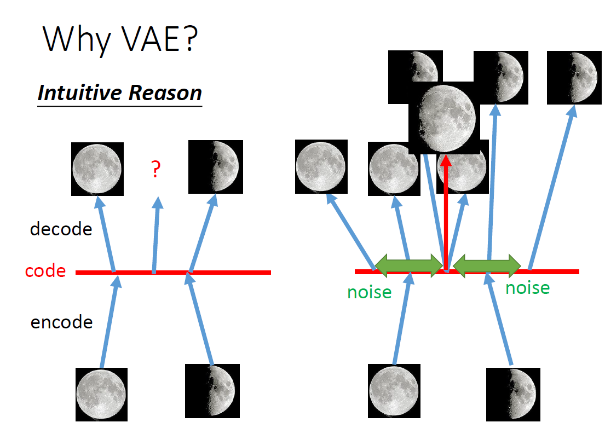 

所以这个encoder output m代表是原来的code，这个c代表是加上noise以后的code。decoder要根据加上noise以后的code把它reconstruct回原来的image。 $\sigma$ 代表了noise的variance，e是从normal distribution sample出来的值，所以variance是固定的，当你把 $\sigma$ 乘上e再加上m的时候就等于你把原来的code加上noise，e是从normal distribution sample出来的值，所以variance是固定的，但是乘上一个 $\sigma$ 以后，它的variance 大小就有所改变。这个variance决定了noise的大小，这个variance是从encoder产生的，也就是说：machine在training的时候，它会自动去learn这个variance会有多大。

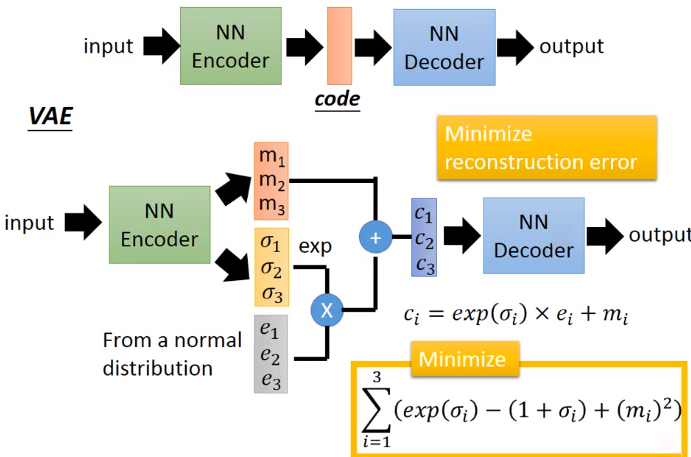 

但是如果还是这样子还是不够的，假如你现在的training只考虑：现在input一张image，中间有加noise的机制，然后dec oder reconstruct回原来的image，然后minimize 这个reconstruct error，你只有做这件事情是不够的，你training的出来的结果并不会如你所预期的样子。

因为这个variance是自己学的，假设你让machine自己决定说variance是多少，它一定会决定说 variance是0就好了(就像让自己决定自己的分数的话，得100分就好了)。所以variance只让machine自己决定的话，variance是0就ok了，那就等于原来的auto-encoder。所以你要这个variance上面去做一些限制，强迫它的variance不可以太小。所以我们另外加的这一项 $\sum_{i=1}^{3}(exp(\sigma_i)-(1+\sigma_i)+(m_i)^2)$ ，这一项其实就是对variance做了一下限制
 

这边有 $exp(\sigma_i)-(1+\sigma_i)$ ， $exp(\sigma_i)$ 是图中蓝色的线， $(1+\sigma_i)$ 是图中红色的这条线。把蓝色线减去红色线得到的是绿色这条线，绿色这条线的最低点是落在 $\sigma=0$ 的地方， $\sigma=0$ 的话，exp( $\sigma$ )=1，意味着variance=1( $\sigma=0$ 的时候loss最后，意味着variance=1的时候loss最低)。所以machine就不会说：让variance=0，然后minimize reconstruct error，它还要考虑variance不能够太小。最后这一项 $m_i^2$ 就相当于加了是L2-Norm。我们常常在training auto-encoder的时候，你就会在你的code上面加上regularization，让它的结果不会overfitting。

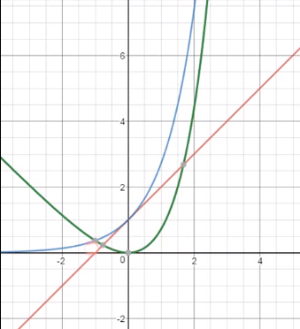 

 
刚才是比较直观的理由，正式的理由这样的，以下是paper上比较常见的说法。假设我们回归到我们要做的事情是什么，你要machine generate 这个pokemon的图，那每一张pokemon的图都可以想成是高维空间中的一个点。假设它是20*20的image，在高维空间中也就是400 *400维的点，在图上我们用一维描述它，但其实是一个高维的空间。那现在要做的事情就是Estimate高维空间上的几率分布，我们要做的事情就是estimate这个p(x)，只要我们estimate p(x)的样子，那我们就可以根据p(x)去sample出一张图，找出来的图就会是像宝可梦的样子(p(x)几率最高的比较容易被sample1出来)。这个p(x)理论上在有pokemon的地方，它的几率是最大的，若在怪怪的图上，几率是低的。如果我们今天能够estimate the probability distributon就结束了。

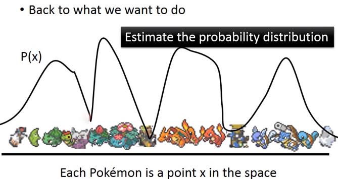 

咋样estimate the probability distributon呢？我们可以用gaussion mixture model。guassion mixture model：我们现在有一个distribution(黑色的线)，这个黑色的distribution其实是很多的gaussion(青蓝色)用不同的weight叠合起来的结果。如果你的gaussion数目够多，你就可以产生很复杂的distribution，公式为 $p(x)=\sum_{m}p(m)p(x|m)$ 。

###  高斯混合模型

如果你要从p(x)sample出一个东西的时候，你先要决定你要从哪一个gaussion sample东西，假设现在有100gaussion(每一个gaussion都有自己的一个weight)，你根据每个gaussion的weight去决定你要从哪一个gaussion sample data。所以你要咋样从一个gaussion mixture model smaple data呢？首先你有一个multinomial distribution，你从multinomial distribution里面决定你要sample哪一个gaussion，m代表第几个gaussion，它是一个integer。你决定好你要从哪一个m sample gaussion以后，，你有了m以后就可以找到 $\mu ^m,Σ^m$ (每一个gaussion有自己的 $\mu ^m,Σ^m$ )，根据 $\mu ^m,Σ^m$ 就可以sample一个x出来。所以p(x)写为summation over所有的gaussion，哪一个gaussion的weight乘以有一个gaussion sample出x的几率 

每一个x都是从某一个mixture被sample出来的，这件事情其实就很像是做classification一样。我们每一个所看到的x，它都是来自于某一个分类。但是我们之前有讲过说：把data做cluster是不够的，更好的表示方式是用distributed representation，也就是说每一个x它并不是属于某一个class，而是它有一个vector来描述它的各个不同面向的特性。所以VAE就是gaussion mixture model distributed representation的版本。

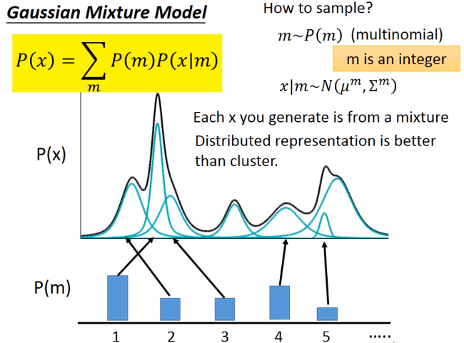 

首先我们要sample一个z，这个z是从normal distribution sample出来的。这个vector z的每一个dimension就代表了某种attribute，假设是z是这样的(如图)，现在图上假设它是低维的，但是在实际上它是高维的，到底是几维你自己决定。接下来你Sample z以后，根据z你可以决定 $\mu(z),variance$ ，你可以决定gaussion的 $\mu,\sigma$ 。刚才在gaussion model里面，你有10个mixture，那你就有10个 $\mu,\sum $ ，但是在这个地方，你的z有无穷多的可能，所以你的 $\mu,variance $ 也有无穷多的可能。那咋样找到这个 $\mu,  variance $ 呢？做法是：假设 $\mu,variance $ 都来自于一个function，你把z带到产生 $\mu$ 的这个function $N(\mu(z),\sigma(z))$ ， $\mu(z)$ 代表说：现在如果你的attribute是z的时候，你在x space上面的 $\mu$ 是多少。同理 $\sigma(z)$ 代表说：variance是多少

其实P(x)是这样产生的：在z这个space上面，每一个点都有可能被sample到，只不过是中间这些点被sample出来的几率比较大。当你sample出来点以后，这个point会对应到一个guassion。至于一个点对应到什么样的gaussion，它的 $\mu,\sum$ 是多少，是由某一个function来决定的。所以当gaussion是从normal distribution所产生的时候，就等于你有无穷多个gaussion。

另外一个问题就是：我们肿么知道每一个z应该对应到什么样的 $\mu,\sum$ (这个function如何去找)。我们知道neural network就是一个function，所以你就可以说：我就是在train一个neural network，这个neural network就是z，它的output就是两个vector( $\mu(z),\sigma(z)$ )。第一个vector代表了input是z的时候你gaussion的 $\mu$ ， $\sigma$ 代表了variance

我们有一个neural network可以告诉我们说：在z这个space上面的每一个点对应到x的space时，你的 $\mu,variance$ 分别是多少。

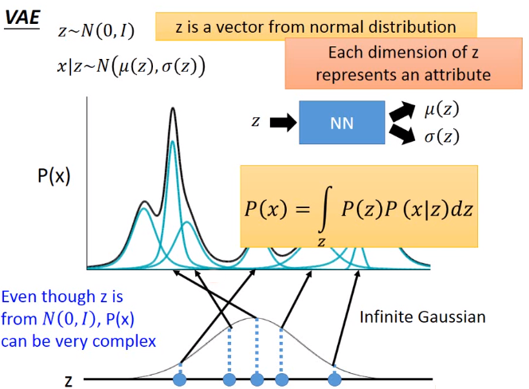 

p(x)的distribution会这样的：P(z)的几率跟我们知道z的时候x的几率，在对所有可能的z做积分(因为z是continue的)。那你可能会困惑，为什么是gaussion呢？你可以假设任何形状的，这是你自己决定的。你可以说每一个attribute的分布就是gaussion，极端的case总是少的，比较没有特色的东西总是比较多的。你不用但心说：你如果假设gaussion会不会对p(x)带来很大的限制。其实不用担心这个问题，NN是非常powerful的，NN可以represent任何的function。所以就算你的z是normal distribution，最后的p(x)最后也可以是很复杂的distribution。

### 最大化可能性
p(z) is a normal distribution，我们先知道z是什么，然后我们就可以决定x是从咋样的 $\mu,variance$ function里面被sample出来的， $\mu,variance$ 中间是关系是不知道的。咋样找呢？它的equation就是maximizing the likelihood，我们现在手上已经有一笔data x，你希望找到一组 $\mu$ 的function和 $\sigma$ 的function，它可以让你现在已经有的image(每一个x代表一个image)，它的p(x)取log之后相加是被maximizing。所以我们要做的事情就是，调整NN里面的参数(每个neural的weight bias)，使得likehood可以被maximizing。

引入另外一个distribution，叫做 $q(z|x)$ 。也就是我们有另外一个 $NN'$ ，input一个x以后，它会告诉你说：对应z的 $\mu',\sigma'$ (给它x以后，它会决定这个z要从什么样的 $\mu,variance$ 被sample出来)。上面这个NN就是VAE里的decoder，下面这个 $NN'$ 里的encoder

  

 $logP(x)=\int_{z}q(z|x)logP(x)dz$ ，因为 $q(z|x)$ 它是一个distribution，对任何distribution都成立。假设 $q(z|x)$ 是路边捡来的distribution(可以是任何的distribution)，因为这个积分是跟P(x)无关的，然后就可以提出来，积分的部分就会变成1，所以左式就等于右式。

最后得到式子如图所示，右边的式子中 $q(z|x)$ 是一个distribution， $logP(x)=\int_{z}q(z|x)logP(x)dz$ 也是一个distribution，KL divergence代表这两个distribution相近的程度(KL divergence越大，代表这个distribution越不像，KL divergence衡量一个距离的概念)，右边这个式子是距离，所以一定是大于等于0，所以L一定会大于等于 $\int_{m}q(z|x)log(\frac{p(x|z)p(z)}{q(z|x)})$ 这一项，这一项即是lower bounud，称为 $L_b$ 。

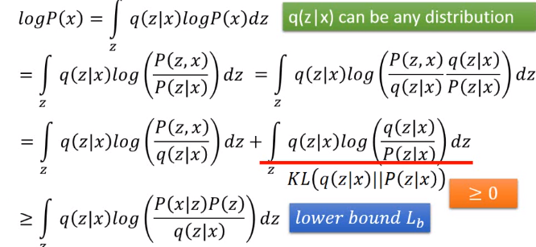 

我们要maximizing的对象是由这两项加起来的结果，在 $L_b$ 这个式子中，p(z)是已知的，我们不知道的是 $p(x|z)$ 。我们本来要做的事情是要找 $p(x|z)$ 跟 $q(z|x)$ ，让这个likehood越大越好，现在我们要做的事情变成要找找 $p(x|z)$ 跟 $q(z|x)$ ，让 $L_b$ 越大越好。如果我们只找这一项的话( $p(x|z)$ )，然后去maximizing  $L_b$  的话，你增j加 $L_b$ 的时候，你有可能会增加你的likehood，但是你不知道你的likehood跟lower bound之间到底有什么样的距离。你希望你做到的是：当你的lower bound上升的时候，你的likehood也跟着上升。但是有可能会遇到糟糕的事情是：你的lower bound上升的时候，likehood反而下降(因为不知道它们之间的差距是多少)。

所以引入这一项( $L_b$ )可以解决刚才说的那个问题。因为：如图蓝色的是likehood， $likehood=L_b+KL$ ，如果你今天调 $q(z|x)$ maximizing  $L_b$ 的话。你会发现说 $q(z|x)$ 跟log p(x)是没有关系的(log p(x)。但是我们却maximizing  $L_b$ 代表说你minimize这个KL divergence，也就是说你让lower bound跟likehood越来越接近(maximize  $q(z|x)$ )。加入你今天去固定住 $p(x|z)$ 这一项，去调 $q(z|x)$ 这一项的话，你会让 $L_b$ 一直上升，这个KL divergence会完全不见。因为你的likehood一定要比lower bound大，所以你确定likehood一定会上升。

今天我们也会得到一个副产物，你当你maximize $q(z|x)$ 这一项的时候，你会让KL divergence越来越小，意味着说：你会让 $q(z|x)$ 跟 $p(z|x)$ 越来越接近。所以接下来做的事情就是找 $p(x|z)$ 跟 $q(z|x)$ ，可以让 $L_b$ 越大越好，就等同于让likehood越来越大。在最后你顺便会找到 $q(z|x)$  approximation p(z|x)。

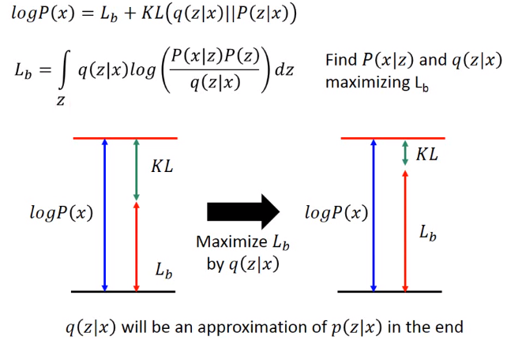 

 $p(z)$ 是一个distribution， $q(z|x)$ 也是一个distribution，所以 $\int_{z}q(z|x)log\frac{p(z)}{q(z|x)}$ 是KL divergence。复习一下，q是一个neural network，当你给x的时候，它会告诉你： $q(z|x)$ 是从什么样的 $\mu,variance$ gaussion sample出来的。

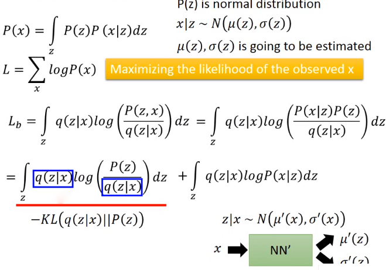 

### 与网络连接
你要minimizing KL $(q(z|x)||p(z))$ 的话，你就是去调q对应的neural network产生的distribution可以跟normal distribution越接近越好。minimize这一项其实就是我们刚才在reconstruction error另外加的那一项，它要做的事情就是minimize KLdivergence，它要做的事情就是：希望 $q(z|x)$ 的output跟normal distribution是接近的

 

还有另外一项 $\int_{z}q(z|x)log P(x|z)dz$ ，可以写成 $logP(x|z)$ 根据 $q(z|x)$ 的期望值。从 $q(z|x)$ 去sample data，然后让 $logP(x|z)$ 的几率越大越好，其实这件事情就是auto-encoder在做的事情。咋样理解从 $q(z|x)$ 去sample data：你把x丢进neural network里面去，产生一个 $\mu,variance$ 。根据 $\mu,variance$ 你就可以sample出来一个z。接下来maximize产生 $logP(x|z)$ 的几率，其实就是把z丢到另外neural network，产生一个 $\mu,variance$ 。咋样让这个几率越大越好呢？假设我们忽视variance(一般在实做里面不会把variance这件事考虑进去)，只考虑 $\mu$ 这一项的话。你要做的就是让 $\mu$ 跟x越接近越好。现在是gaussion distribution，在 $\mu$ 的几率是最大的，所以你要NN output这个 $\mu$ 等于x的话，那 $logP(x|z)$ 这一项是最大的。

所以整个case就变成说：input一个x，然后产生两个vector，产生一个z，再根据这个z，产生另外一个vector跟原来的x越接近越好。其实这件事情就是auto-encoder在做的事情，你要你的input跟output越接近越好。所以这两项合起来就是前面看到的VAE的loss function

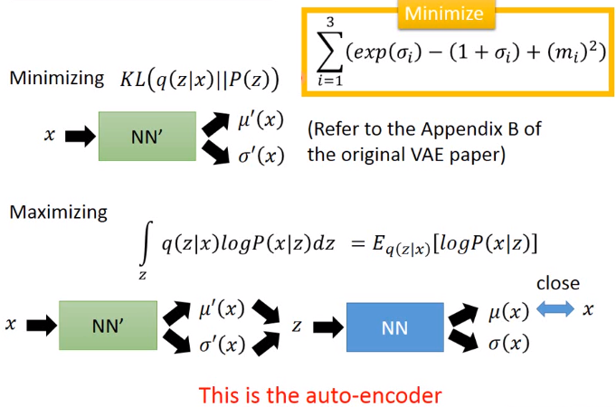 

### 有条件的VAE

还有一种conditional VAE，如果你让VAE可以产生手写的数字，就是给它一个digit，然后它把这个digit的特性抽取出来(笔画的粗细等等)，然后丢进encoder的时候一方面给它有关这个数字特性的distribution，另外一方面告诉decoder它是什么数字。那你就可以根据这一个digit，generate跟它style相近的digit。你会发现说conditional VAE可以根据某一个digit画出跟它style相近的数字。

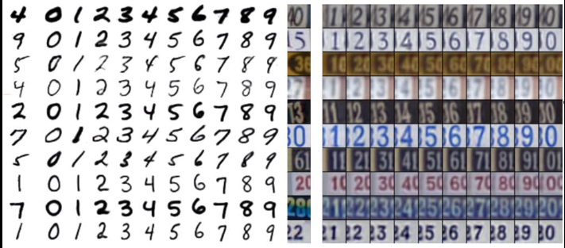 

这是一些reference提供参考：
Carl Doersch, Tutorial on Variational Autoencoders 

Diederik P. Kingma, Danilo J. Rezende, Shakir Mohamed, Max Welling,"Semi-supervised learning with deep generative models."NIPS,2014.

Sohn, Kihyuk, Honglak Lee, and Xinchen Yan,"Learning Structured Output Representation using Deep Conditional Generative Models."NIPS,2015.

Xinchen Yan, Jimei Yang, Kihyuk Sohn, Honglak Lee,"Attribute2lmage: Conditional Image Generation from Visual Attributes", ECCV,2016

Cool demo:
· http://vdumoulin. github. io/morphing_faces/
· http://fvae. ail. tokyo/

### VAE的问题

VAE其实有一个很严重的问题就是：它从来没有真正学咋样产生一张看起来像真的image，它学到的东西是：它想要产生一张image，跟我们在database里面某张image越接近越好。但它不知道的是：我们evaluate它产生的image跟database里面的相似度的时候(MSE等等)，decoder output跟真正的image之间有一个pixel的差距，不同的pixel落在不同的位置会得到非常不一样的结果。假设这个不一样的pixel落在7的尾部(让7比较长一点)，跟落在另外一个地方(右边)。你一眼就看出说：右边这是怪怪的digit，左边这个搞不好是真的(只是长了一点而已)。但是对VAE来说都是一个pixel的差异，对它来说这两张image是一样的好或者是一样的不好。

所以VAE学的只是咋样产生一张image跟database里面的一模一样，从来没有想过：要真的产生可以一张以假乱真的image。所以你用VAE来做training的时候，其实你产生出来的image往往都是database里面的image linear combination而已。因为它从来都没有想过要产生一张新的image，它唯一做的事情就是模仿而已

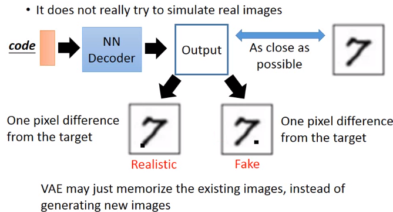

 
所以接下来有了一个方法Generative Adversarial Network(GAN)，最早出现在2014年。

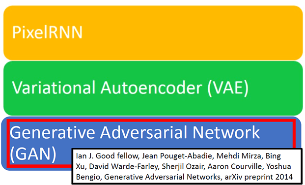 

这里引用了Yann LeCun's comment，有人问了：what are some recent and potentially upcoming breakthrough in unsupervised learning，Yann LeCun's 亲自来回答：adversarial training is the coolest thing since sliced bread(since sliced bread__有始以来)

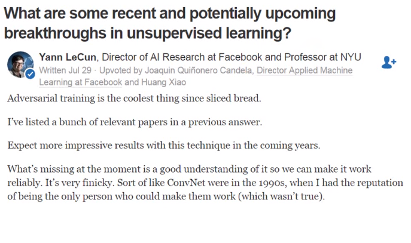 

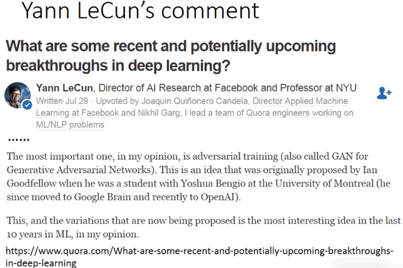
 
## GAN

GAN的概念像是拟态的演化，如图是一个枯叶蝶(长的像枯叶一样)，枯叶蝶咋样变得像枯叶一样的呢？也许一开始它长是这个样子(如左图)。但是它有天敌(麻雀)，天敌会吃这个蝴蝶，天敌辨识是不是蝴蝶的方式：它知道蝴蝶不是棕色的，所以它吃不是棕色的东西。所以蝴蝶就演化了，它就变成了棕色的了。它的天敌会跟着演化，天敌知道蝴蝶是没有叶脉的，所以它会吃没有叶脉的东西。所以蝴蝶演化变成枯叶蝶(有叶脉)，它的天敌也会演化，蝴蝶和它的天敌会共同的演化，枯叶蝶会不断的演化，直到和枯叶无法分别为止。

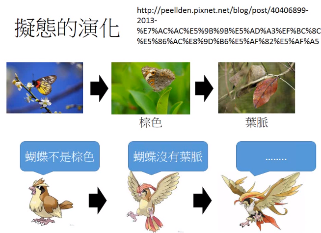
 
所以GAN的概念是非常类似的，首先有第一代的generator，generate一些奇怪的东西(看起来不是像是image)。接下来有第一代的Discriminator(它就是那个天敌)，Discriminator做的事情就是：它会根据real images跟generate产生的images去调整它里面的参数，去评断说：这是真正的image还是generate产生的 image。接下来generator根据discriminator调整了下它的参数，所以第二代generator产生的digit更像是真的image，接下来discri minator会根据第二代generator产生的digit跟真正的digit再update它的参数。接下来产生第三代generator，产生的digit更像真正的数字(第三代generator产生的digit可以骗过第二个discri minator)，但是discri minator也会演化，等。

### The evolution of generation 　

你要注意的一个地方就是：这个Generator它从来没有看过真正的image长什么样子，discri- minator有看过真正的digit长什么样子，它会比较正真正的image和generator的不同，它要做的就是骗过discri-minator。generator没有看过真正的image，所以generate它可以产生出来的image是database里面从来都没有见过的，这比较像是我们想要machine做的事情。

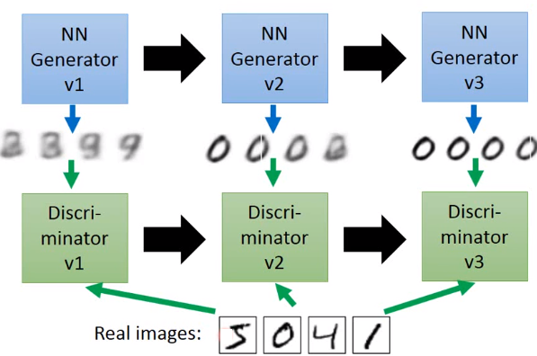 

我们来看discriminator是咋样train的：这个discriminator就是一个neural network，它的input就是一张image，它的output就是一个number(可以通过sigmoid function让值介于0-1之间，1代表input这一张image是真正的image，0代表是generator所产生的)。generator在这里的架构其实就跟VAE的decoder是一摸一样的，它也是neural network，它的input就是从一个distribution sample出来的vector，你把sample出来的vector丢到generator里面，它就会产生一个数字(image)，你给它不同的vector，它就会产生不同样子的image，先用generator产生一堆image(假的)。我们有真正的image，discriminator就是把generator所产生的image都label为0，把真正的image都label为1。

### GAN-辨别器

现在有可第一代的discriminator，咋样根据discriminator update 第一代的。首先我们随便输入一个vector，它会随便产生一张image，这张image没有办法骗过discriminatior，把generator产生的image丢到discriminatior里面，它得出有0.87。接下来我们就得调这个generator的参数，让现在的discriminator会认为说：generator出来的image是真的，也就是说：generator出来的image丢到discriminator里面，discriminator output越接近1越好，所以你希望generator出来是这样的image，discriminator output是1.0觉得它是真正的image。

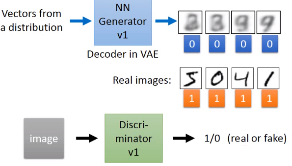 

### GAN-生成器

generator就是一个neural network，discriminator也是一个neural network，你把generator output当做discriminator的 input，然后再让它产生一个值。这件事情就好像是：你有一个很大很大的neural network，你丢一个randomly vector，它的output就是一个值，所以generator和discriminator合起来就是一个很大的neural network，你要让这个network再丢进一个randomly vector，output 1这件事是很容易的，你做gradient descent就好了。你就gradient descent调整参数，希望丢进这个vector的时候，它的output是要接近1的。但是你要注意的事情是：你在调整这个参数的时候，你只能够调整generator的参数(只能算generator的参数对output的gradient)，必须fix the discriminator。如果你没有fix the discriminator的话会发生：对discriminator来说，要让它output 1很简单，在最后output的bias设为1，其他weight都设0，output就是1了。

所以你要整个network input randomly vector，output是1的时候，你要fix the discriminator的参数，只调generator的参数，这样才会骗过。

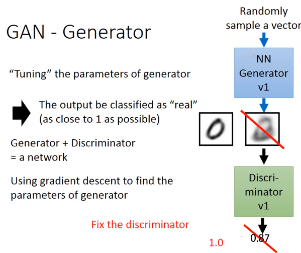 

### GAN-Toy Example

这是来自GAN paper的Toy example，Toy example是这样子的：z(z是one dimension)丢到generator里面，会产生另外一个one dimension的东西(这个z可以从任何的distribution sample出来，在这个例子是从uniform distribution sample出来的)，每一个不同的z会得到不同的x，x的分布就绿色这条个分布。现在要做的事情是：希望这个generator的output可以越像real data越好，real data就是黑色的这些点，也就绿色这条distribution可以跟黑色的点越接近越好。按照GAN的概念的话，你就把generator的output x跟real data丢到discriminator里面，然后让discriminator去判断来自真正data的几率跟generator output几率(如果是真正的data 几率就是1，反之就是0)

假设generator还很弱，产生的green distribution是这样子(中间图)，discriminator根据real data跟generator distribution得出的是蓝色的线，这条蓝色的线告诉我们，如果是在右半区，比较有可能是假的(generator产生的)，如果是在左半区，比较有可能是real data。接下来generator根据discriminator的结果去调整它的参数(generator要做的事情就是要骗过discriminator)，既然discriminator认为在中间那个图左半区比较有可能是real data，那generator output就往左边移，也有可能移太多偏到左边去了，所以要小心的调整参数，generator会骗过它产生新的distribution。这个process会一直进行下去，直到最后generator output跟real data一模一样，discriminator没有办法分辨真正的data。

问题：你不知道discriminator是不是对的，你说discriminator得到一个很好的结果，那有可能是generator太废，有时候discriminator得到一个很差的结果，它认为每个地方抖没法分辨是不是real value，这个时候并不能说：generator很像，有可能是discriminator太弱了，所以这是一个还没有solution的难题。

所以在train GAN的时候，你会一直坐在电脑旁边看它产生的image，因为你从generator跟discriminat的loss你看不出generate是否好，所以你generator updata一次参数，你就去看看generate一些image看看有没有比较好，如果方向走错了，在重新调整一下参数，所以这是非常困难的。

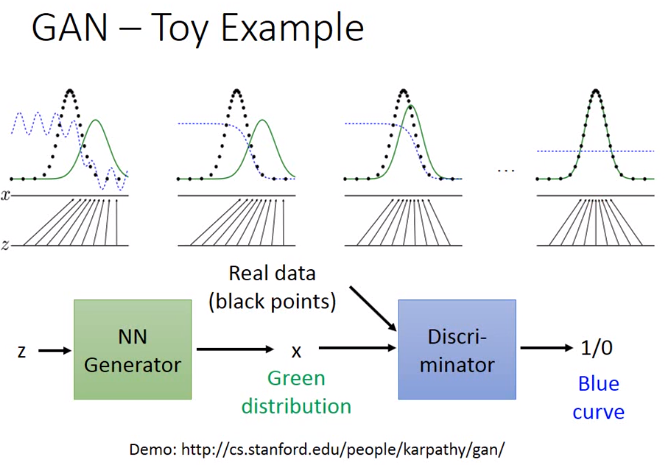 

最大的问题就是你没有一个很明确的signal，它可以告诉现在的generator现在做的什么样子。在standard NNS里面，你就看那个loss，loss越来越小就代表train越来越好。但是在GAN里面，你其实要做的事情是：keep generator跟discriminator是well-matched
，不断处于一个竞争的状态。

这就很麻烦，你要让generator跟discriminator一直处于竞争的状态，所以你就要一个不可思议的平衡感来调整参数。
当discriminator fail的时候，我们train的终极目标是希望generator产生的output被discriminator无法分别的(正确率为0)，但是往往当你discriminator fail的时候，并不代表说：generator真正generate出很好的image，往往遇到的状况是generator是太弱了。

